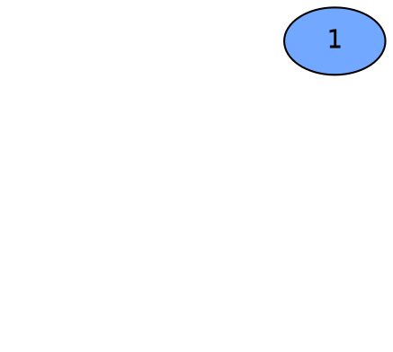
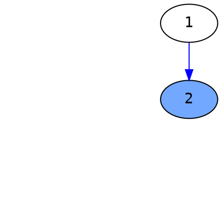
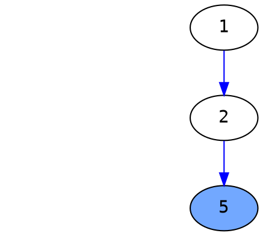

# [Binary Tree Paths (#257)](https://leetcode.com/problems/binary-tree-paths/)

## Description

Given a binary tree, return all root-to-leaf paths.

Note: A leaf is a node with no children.

---

## Example

```
Input:

   1
 /   \
2     3
 \
  5

Output: ["1->2->5", "1->3"]

Explanation: All root-to-leaf paths are: 1->2->5, 1->3
```

---

## Solution

### Algorithm

Use the backtracking, again.

1. If node is None, return.
2. Check the incoming node, if it is leaf, then build the path.
3. Otherwise, append the **val** to list, and do the recursive call with **node.left** and **node.right**.
4. Then, pop the last element of list, return to last callee.

<!--more-->

---

### Run

```
Input:

   1
 /   \
2     3
 \
  5
```

---



Append 1 to path, recursive call its left node.

```python
path = [1]
paths = []
```

---



Append 2 to path, recursive call its left node.

```python
path = [1, 2]
paths = []
```

---


Left node is leaf, return to parent.
Recursive call its right node.

```python
path = [1, 2]
paths = []
```

---



5 is leaf, store the path to paths and pop the last element of path.

```python
path = [1, 2]
paths = [["1->2->5"]]
```

---


Return to 2, pop the last element of path.

```python
path = [1]
paths = [["1->2->5"]]
```

---


Return to 1, recursive call its right node.

```python
path = [1]
paths = [["1->2->5"]]
```

---


3 is leaf node, store the path in paths and pop the last element of path.

```python
path = [1]
paths = [["1->2->5"], ["1->3"]]
```

---


Return to 1, pop the last element of path.
Finished.

```python
path = []
paths = [["1->2->5"], ["1->3"]]
```

---

### Code

```python
# Definition for a binary tree node.
# class TreeNode(object):
#     def __init__(self, x):
#         self.val = x
#         self.left = None
#         self.right = None

class Solution(object):
    def binaryTreePaths(self, root):
        """
        :type root: TreeNode
        :rtype: List[str]
        """
        paths = []
        self.backtracking(paths, [], root)
        return paths


    def backtracking(self, paths, path, node):
        if node is None:
            return
        path.append(str(node.val))
        if self.isLeaf(node):
            paths.append("->".join(path))
        else:
            self.backtracking(paths, path, node.left)
            self.backtracking(paths, path, node.right)
        path.pop()

    def isLeaf(self, node):
        return node.left is None and node.right is None
```
