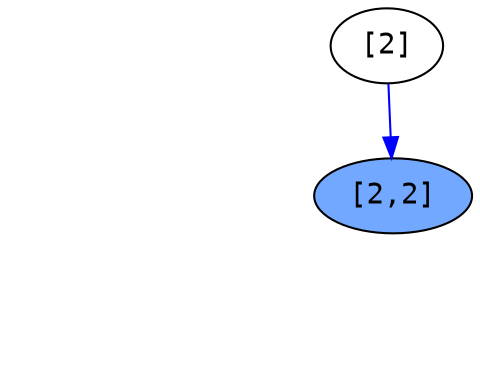
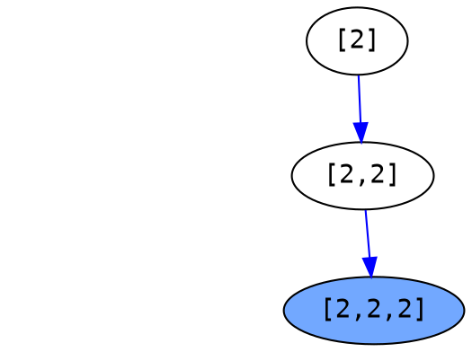
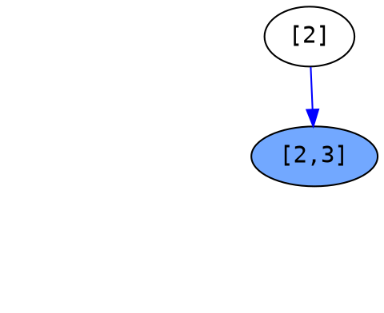
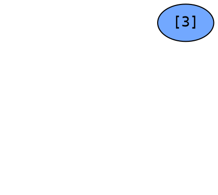

# [Combination Sum (#39)](https://leetcode.com/problems/combination-sum/)

## Description

Given a **set** of candidate numbers (`candidates`) **(without duplicates)** and a target number (`target`), find all unique combinations in candidates where the candidate numbers sums to `target`.

The **same** repeated number may be chosen from candidates unlimited number of times.

Note:

All numbers (including `target`) will be positive integers.
The solution set must not contain duplicate combinations.

---

## Example

### Example 1

```
Input: candidates = [2,3,6,7], target = 7,
A solution set is:
[
  [7],
  [2,2,3]
]
```

### Example 2

```
Input: candidates = [2,3,5], target = 8,
A solution set is:
[
  [2,2,2,2],
  [2,3,3],
  [3,5]
]
```

---

## Solution

---

### Algorithm
Again, use the backtracking to solve it.

Parameters:
`solution set`, `solution`, `begin`, `target`, `candidates`

```
If the incoming `target` is zero, save the `solution` to `solution set` and return.

Otherwise, iterate all `candidate` from `begin` to end of `candidates`:
    If `candidate` is less or equal than `target`:
        add `candidate` to `solution`
        update `target` to `target` - `candidate`
        update `begin` to index of `candidate`
        backtracking with updated parameter `solution` and `target`
        pop `candidate` from `solution`
```

<!--more-->

---

### Run

```
Input: candidates = [2,3,6,7], target = 7
```

---

```graphviz
digraph hierarchy {
    node [color=Black,fontname=Courier,shape=oval] //All nodes will this shape and colour
    nodesep=1.0 // increases the separation between nodes
    rank1 [style=invisible]
    rank2 [style=invisible]
    rank3 [style=invisible]
    rank1 -> rank2 -> rank3 [color=white]
    subgraph return {
        edge [color=Gray, style=dashed] //All the lines look like this
    }
    subgraph current {
        edge [color=Blue]
    }
    {
        rank=same;
        rankdir=LR;
    } 

}
```

Initial

```python
begin = 0
target = 7
solution = []
solution_set = []
candidate = [2, 3, 6 ,7]
```

---


2 <= `target`, put in `solution`.
Update `target` to `target` - 2.
Update `begin` to index of 2.

```python
i = 0

begin = 0
target = 5
solution = [2]
solution_set = []
candidate = [2, 3, 6 ,7]
```

---



2 <= `target`, put in `solution`.
Update `target` to `target` - 2.
Update `begin` to index of 2.

```python
i = 0

begin = 0
target = 3
solution = [2, 2]
solution_set = []
candidate = [2, 3, 6 ,7]
```

---



2 <= `target`, put in `solution`.
Update `target` to `target` - 2.
Update `begin` to index of 2.

```python
i = 0

begin = 0
target = 1
solution = [2, 2, 2]
solution_set = []
candidate = [2, 3, 6 ,7]
```

---


None of candidate are less or equal to target, return to last callee.

```python
begin = 0
target = 1
solution = [2, 2, 2]
solution_set = []
candidate = [2, 3, 6 ,7]
```

---


Pop last candidate from `solution`.
Resume `target`.
Resume `begin`.

```python
i = 0

begin = 0
target = 3
solution = [2, 2]
solution_set = []
candidate = [2, 3, 6 ,7]
```

---


3 <= `target`, put in `solution`.
Update `target` to `target` - 3.
Update `begin` to index of 3.

```python
i = 1

begin = 1
target = 0
solution = [2, 2, 3]
solution_set = []
candidate = [2, 3, 6 ,7]
```

---


`target` is zero,  put `solution` to `solution set`.
Return.

```python
i = 1

begin = 1
target = 0
solution = [2, 2, 3]
solution_set = [[2, 2, 3]]
candidate = [2, 3, 6 ,7]
```

---


Pop last element of `solution`.
Resume `target`.
Resume `begin`.

```python
i = 1

begin = 0
target = 3
solution = [2, 2]
solution_set = [[2, 2, 3]]
candidate = [2, 3, 6 ,7]
```

---


From rest of `candidates`, none of candidate <= `target`.
Return to last callee.


```python
begin = 0
target = 3
solution = [2, 2]
solution_set = [[2, 2, 3]]
candidate = [2, 3, 6 ,7]
```

---


Pop last element of `solution`.
Resume `target`.
Resume `begin`.


```python
begin = 0
target = 5
solution = [2]
solution_set = [[2, 2, 3]]
candidate = [2, 3, 6 ,7]
```

---



3 <= `target`, put in `solution`.
Update `target` to `target` - 3.
Update `begin` to index of 3.


```python
i = 1

begin = 1
target = 2
solution = [2, 3]
solution_set = [[2, 2, 3]]
candidate = [2, 3, 6 ,7]
```

---


For rest of `candidate`, none of them <= `target`.
Return.


```python
begin = 1
target = 2
solution = [2, 3]
solution_set = [[2, 2, 3]]
candidate = [2, 3, 6 ,7]
```

---


Pop last element of `solution`.
Resume `target`.
Resume `begin`.


```python
begin = 0
target = 5
solution = [2]
solution_set = [[2, 2, 3]]
candidate = [2, 3, 6 ,7]
```

---


For rest of `candidate`, none of them <= `target`.
Return.


```python
begin = 0
target = 5
solution = [2]
solution_set = [[2, 2, 3]]
candidate = [2, 3, 6 ,7]
```

---

```graphviz
digraph hierarchy {
    node [color=Black,fontname=Courier,shape=oval] //All nodes will this shape and colour
    nodesep=1.0 // increases the separation between nodes
    rank1 [style=invisible]
    rank2 [style=invisible]
    rank3 [style=invisible]
    rank1 -> rank2 -> rank3 [color=white]
    subgraph return {
        edge [color=Gray, style=dashed] //All the lines look like this
    }
    subgraph current {
        edge [color=Blue]
    }
}
```

Pop last element of `solution`.
Resume `target`.
Resume `begin`.


```python
begin = 0
target = 7
solution = []
solution_set = [[2, 2, 3]]
candidate = [2, 3, 6 ,7]
```

---



3 <= `target`, put in `solution`.
Update `target` to `target` - 3.
Update `begin` to index of 3.


```python
i = 1

begin = 1
target = 4
solution = [3]
solution_set = [[2, 2, 3]]
candidate = [2, 3, 6 ,7]
```

---


None of candidates <= `target`.
Return


```python
begin = 1
target = 4
solution = [3]
solution_set = [[2, 2, 3]]
candidate = [2, 3, 6 ,7]
```

---

```graphviz
digraph hierarchy {
    node [color=Black,fontname=Courier,shape=oval] //All nodes will this shape and colour
    nodesep=1.0 // increases the separation between nodes
    rank1 [style=invisible]
    rank2 [style=invisible]
    rank3 [style=invisible]
    rank1 -> rank2 -> rank3 [color=white]
    subgraph return {
        edge [color=Gray, style=dashed] //All the lines look like this
    }
    subgraph current {
        edge [color=Blue]
    }
}
```

Pop last element of `solution`.
Resume `target`.
Resume `begin`.


```python
begin = 1
target = 7
solution = []
solution_set = [[2, 2, 3]]
candidate = [2, 3, 6 ,7]
```

---


6 <= `target`, put in `solution`.
Update `target` to `target` - 6.
Update `begin` to index of 6.


```python
i = 2

begin = 2
target = 1
solution = [6]
solution_set = [[2, 2, 3]]
candidate = [2, 3, 6 ,7]
```

---

```graphviz
digraph hierarchy {
    node [color=Black,fontname=Courier,shape=oval] //All nodes will this shape and colour
    nodesep=1.0 // increases the separation between nodes
    rank1 [style=invisible]
    rank2 [style=invisible]
    rank3 [style=invisible]
    rank1 -> rank2 -> rank3 [color=white]
    subgraph return {
        edge [color=Gray, style=dashed] //All the lines look like this
    }
    subgraph current {
        edge [color=Blue]
    }
    {
        rank=same;
        rank1->"[6]" [style=invis];
        rankdir=LR;
    } 
    "[6]" [shape=oval, style=filled, fillcolor="#72a8ff", pos="0,0!"]
}
```

None of candidate <= `target`.
Return.


```python
begin = 2
target = 1
solution = [6]
solution_set = [[2, 2, 3]]
candidate = [2, 3, 6 ,7]
```

---

```graphviz
digraph hierarchy {
    node [color=Black,fontname=Courier,shape=oval] //All nodes will this shape and colour
    nodesep=1.0 // increases the separation between nodes
    rank1 [style=invisible]
    rank2 [style=invisible]
    rank3 [style=invisible]
    rank1 -> rank2 -> rank3 [color=white]
    subgraph return {
        edge [color=Gray, style=dashed] //All the lines look like this
    }
    subgraph current {
        edge [color=Blue]
    }
}
```

Pop last element of `solution`.
Resume `target`.
Resume `begin`.


```python
begin = 2
target = 7
solution = []
solution_set = [[2, 2, 3]]
candidate = [2, 3, 6 ,7]
```

---

```graphviz
digraph hierarchy {
    node [color=Black,fontname=Courier,shape=oval] //All nodes will this shape and colour
    nodesep=1.0 // increases the separation between nodes
    rank1 [style=invisible]
    rank2 [style=invisible]
    rank3 [style=invisible]
    rank1 -> rank2 -> rank3 [color=white]
    subgraph return {
        edge [color=Gray, style=dashed] //All the lines look like this
    }
    subgraph current {
        edge [color=Blue]
    }
    {
        rank=same;
        rank1->"[7]" [style=invis];
        rankdir=LR;
    } 
    "[7]" [shape=oval, style=filled, fillcolor="#72a8ff", pos="0,0!"]
}
```

7 <= `target`, put in `solution`.
Update `target` to `target` - 7.
Update `begin` to index of 7.


```python
i = 3

begin = 3
target = 0
solution = [7]
solution_set = [[2, 2, 3]]
candidate = [2, 3, 6 ,7]
```

---

```graphviz
digraph hierarchy {
    node [color=Black,fontname=Courier,shape=oval] //All nodes will this shape and colour
    nodesep=1.0 // increases the separation between nodes
    rank1 [style=invisible]
    rank2 [style=invisible]
    rank3 [style=invisible]
    rank1 -> rank2 -> rank3 [color=white]
    subgraph return {
        edge [color=Gray, style=dashed] //All the lines look like this
    }
    subgraph current {
        edge [color=Blue]
    }
    {
        rank=same;
        rank1->"[7]" [style=invis];
        rankdir=LR;
    } 
    "[7]" [shape=oval, style=filled, fillcolor="#72a8ff", pos="0,0!"]
}
```

`target` is zero, save the `solution` to `solution_set`.
Return.

```python
begin = 3
target = 0
solution = [7]
solution_set = [[2, 2, 3],[7]]
candidate = [2, 3, 6 ,7]
```

---

```graphviz
digraph hierarchy {
    node [color=Black,fontname=Courier,shape=oval] //All nodes will this shape and colour
    nodesep=1.0 // increases the separation between nodes
    rank1 [style=invisible]
    rank2 [style=invisible]
    rank3 [style=invisible]
    rank1 -> rank2 -> rank3 [color=white]
    subgraph return {
        edge [color=Gray, style=dashed] //All the lines look like this
    }
    subgraph current {
        edge [color=Blue]
    }
}
```

Pop last element of `solution`.
Resume `target`.
Resume `begin`.

```python
begin = 3
target = 7
solution = []
solution_set = [[2, 2, 3],[7]]
candidate = [2, 3, 6 ,7]
```

---

```graphviz
digraph hierarchy {
    node [color=Black,fontname=Courier,shape=oval] //All nodes will this shape and colour
    nodesep=1.0 // increases the separation between nodes
    rank1 [style=invisible]
    rank2 [style=invisible]
    rank3 [style=invisible]
    rank1 -> rank2 -> rank3 [color=white]
    subgraph return {
        edge [color=Gray, style=dashed] //All the lines look like this
    }
    subgraph current {
        edge [color=Blue]
    }
}
```

Have run all of candidate, terminated.

```python
begin = 3
target = 7
solution = []
solution_set = [[2, 2, 3],[7]]
candidate = [2, 3, 6 ,7]
```

---

## Code

```python
class Solution:
    def combinationSum(self, candidates, target):
        """
        :type candidates: List[int]
        :type target: int
        :rtype: List[List[int]]
        """
        combination_list = []
        self.back_tracking(combination_list, [], 0, target, candidates)
        return combination_list


    def back_tracking(self, combination_list, combines, begin, target, candidates):
        if target == 0:
            combination_list.append(combines.copy())
            return
        for i in range(begin, len(candidates)):
            num = candidates[i]
            if num <= target:
                combines.append(num)
                self.back_tracking(combination_list, combines, i, target - num, candidates)
                combines.pop()
```
