# [Letter Combinations of a Phone Number (#17)](https://leetcode.com/problems/letter-combinations-of-a-phone-number/)

## Description

Given a string containing digits from `2-9` inclusive, return all possible letter combinations that the number could represent.

A mapping of digit to letters (just like on the telephone buttons) is given below. Note that 1 does not map to any letters.


---

## Example

```
Input: "23"
Output: ["ad", "ae", "af", "bd", "be", "bf", "cd", "ce", "cf"].
```

---

## Solution

### Recursive function

- Self called function
- Need to define the terminated condition and return

### DFS

- Recursive function
- Only return when reached the boundary condition (e.g., array tail and tree leaf reached)

---

### Backtracking

- Similar to DFS, but when you get the result, you need to continue to get the next solution.
- Useful trick to solve combination-related problem
- When getting the satisfied result, need to **backtracking** to last caller.

---

### Algorithm

1. Check the length of incoming combination. If it equals to the digits length, go to 2. Otherwise, goto 3.
2. Save the combination and return to its caller (i.e. goto 3.2).
3. Use the length of combination to access digit, iterate all mapping characters
    3.1 Push the character into combination and goto 1.
    3.2 Pop the last element of combination, and goto 3.
    
<!--more-->
---

## Run

---

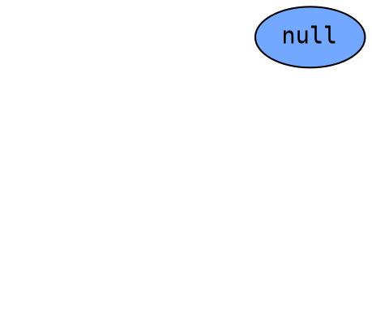

---

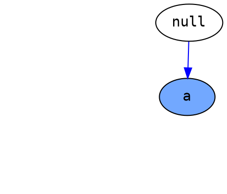

---

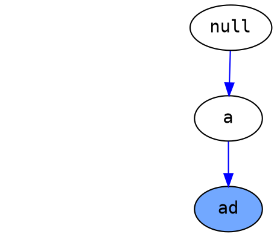

---

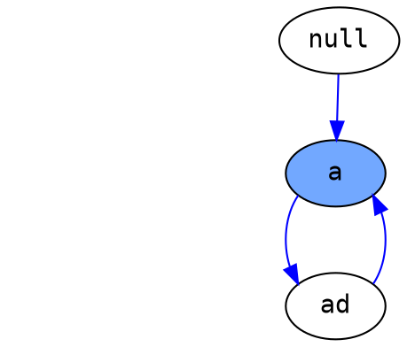

---

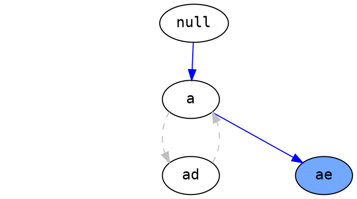

---

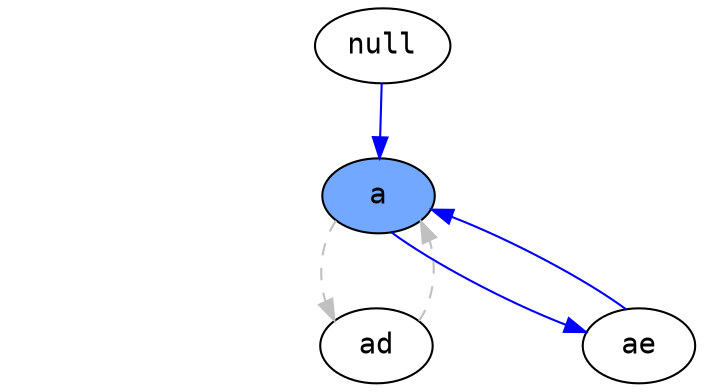

---

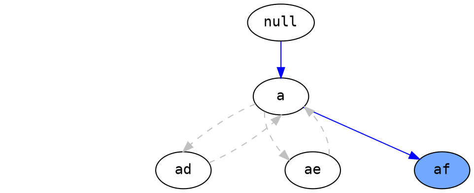

---

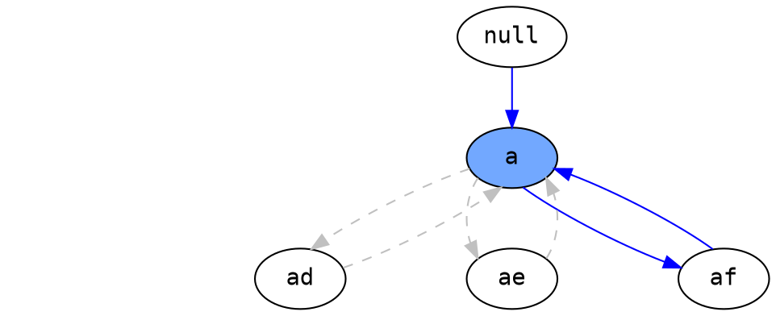

---

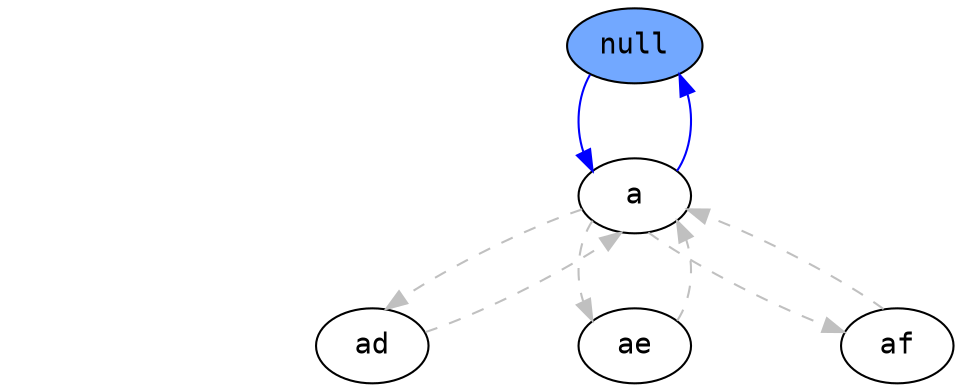

---

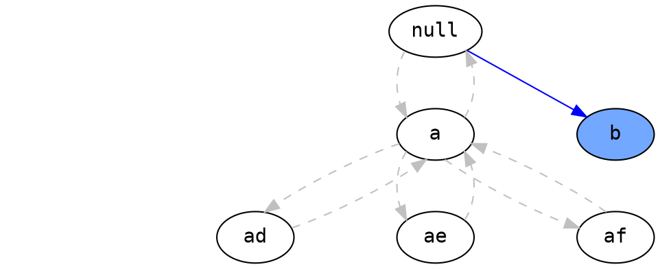

---

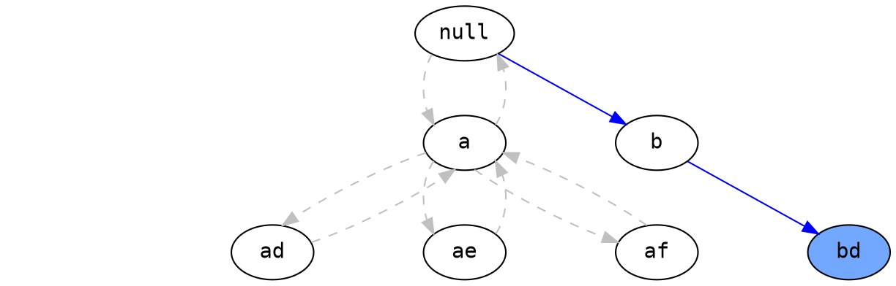

---

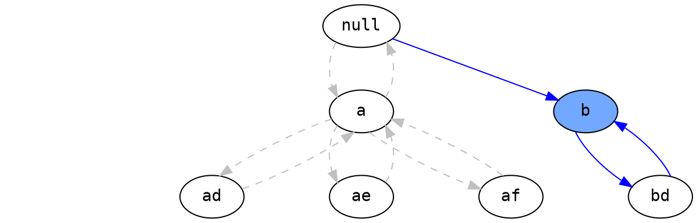

---

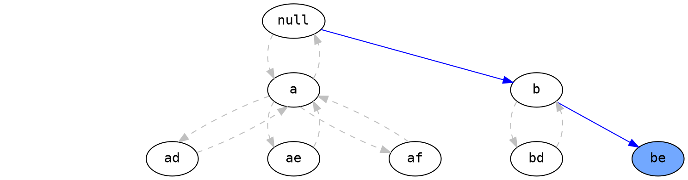

---

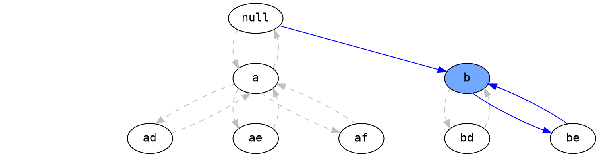

---

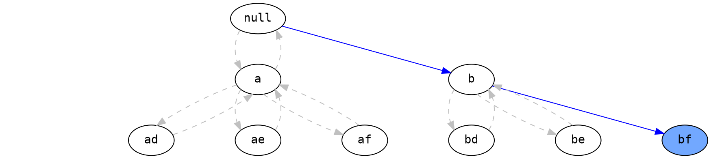

---

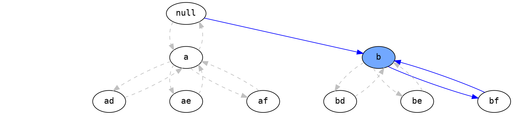

---

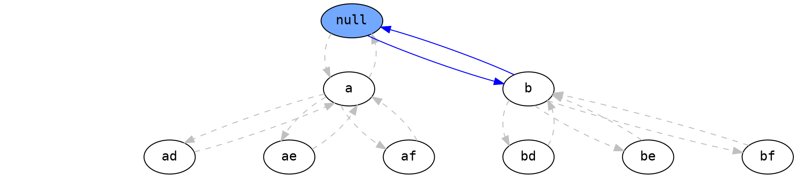

---

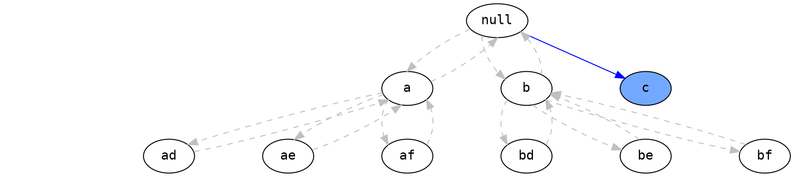

---

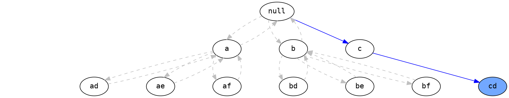

---

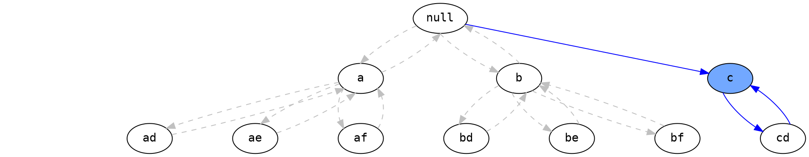

---

```graphviz
digraph hierarchy {
    node [color=Black,fontname=Courier,shape=oval] //All nodes will this shape and colour
    nodesep=1.0 // increases the separation between nodes
    rank1 [style=invisible]
    rank2 [style=invisible]
    rank3 [style=invisible]
    rank1 -> rank2 -> rank3 [color=white]
    subgraph return {
        edge [color=Gray, style=dashed] //All the lines look like this
        a->ad
        ad->a
        a->ae
        ae->a
        null->a
        a->af
        af->a
        a->null
        b->bd
        bd->b
        b->be
        be->b
        b->bf
        bf->b
        null->b
        b->null
        c->cd
        cd->c
    }
    subgraph current {
        edge [color=Blue]
        null->c
        c->ce
    }
    {
        rank=same;
        rank1->null [style=invis];
        rankdir=LR;
    }  
    {
        rank=same;
        rank2->a->b->c [style=invis];
        rankdir=LR;
    }      
    {
        rank=same;
        rank3->ad->ae->af->bd->be->bf->cd->ce [style=invis];
        rankdir=LR;
    }           
    "ce" [shape=oval, style=filled, fillcolor="#72a8ff"]
}
```

---

```graphviz
digraph hierarchy {
    node [color=Black,fontname=Courier,shape=oval] //All nodes will this shape and colour
    nodesep=1.0 // increases the separation between nodes
    rank1 [style=invisible]
    rank2 [style=invisible]
    rank3 [style=invisible]
    rank1 -> rank2 -> rank3 [color=white]
    subgraph return {
        edge [color=Gray, style=dashed] //All the lines look like this
        a->ad
        ad->a
        a->ae
        ae->a
        null->a
        a->af
        af->a
        a->null
        b->bd
        bd->b
        b->be
        be->b
        b->bf
        bf->b
        null->b
        b->null
        c->cd
        cd->c
    }
    subgraph current {
        edge [color=Blue]
        null->c
        c->ce
        ce->c
    }
    {
        rank=same;
        rank1->null [style=invis];
        rankdir=LR;
    }  
    {
        rank=same;
        rank2->a->b->c [style=invis];
        rankdir=LR;
    }      
    {
        rank=same;
        rank3->ad->ae->af->bd->be->bf->cd->ce [style=invis];
        rankdir=LR;
    }            
    "c" [shape=oval, style=filled, fillcolor="#72a8ff"]
}
```

---

```graphviz
digraph hierarchy {
    node [color=Black,fontname=Courier,shape=oval] //All nodes will this shape and colour
    nodesep=1.0 // increases the separation between nodes
    rank1 [style=invisible]
    rank2 [style=invisible]
    rank3 [style=invisible]
    rank1 -> rank2 -> rank3 [color=white]
    subgraph return {
        edge [color=Gray, style=dashed] //All the lines look like this
        a->ad
        ad->a
        a->ae
        ae->a
        null->a
        a->af
        af->a
        a->null
        b->bd
        bd->b
        b->be
        be->b
        b->bf
        bf->b
        null->b
        b->null
        c->cd
        cd->c
        c->ce
        ce->c
    }
    subgraph current {
        edge [color=Blue]
        null->c
        c->cf
    }
    {
        rank=same;
        rank1->null [style=invis];
        rankdir=LR;
    }  
    {
        rank=same;
        rank2->a->b->c [style=invis];
        rankdir=LR;
    }      
    {
        rank=same;
        rank3->ad->ae->af->bd->be->bf->cd->ce [style=invis];
        rankdir=LR;
    }          
    "cf" [shape=oval, style=filled, fillcolor="#72a8ff"]
}
```

---

```graphviz
digraph hierarchy {
    node [color=Black,fontname=Courier,shape=oval] //All nodes will this shape and colour
    nodesep=1.0 // increases the separation between nodes
    rank1 [style=invisible]
    rank2 [style=invisible]
    rank3 [style=invisible]
    rank1 -> rank2 -> rank3 [color=white]
    subgraph return {
        edge [color=Gray, style=dashed] //All the lines look like this
        a->ad
        ad->a
        a->ae
        ae->a
        null->a
        a->af
        af->a
        a->null
        b->bd
        bd->b
        b->be
        be->b
        b->bf
        bf->b
        null->b
        b->null
        c->cd
        cd->c
        c->ce
        ce->c
    }
    subgraph current {
        edge [color=Blue]
        null->c
        c->cf
        cf->c
    }
    {
        rank=same;
        rank1->null [style=invis];
        rankdir=LR;
    }  
    {
        rank=same;
        rank2->a->b->c [style=invis];
        rankdir=LR;
    }      
    {
        rank=same;
        rank3->ad->ae->af->bd->be->bf->cd->ce [style=invis];
        rankdir=LR;
    }       
    "c" [shape=oval, style=filled, fillcolor="#72a8ff"]
}
```

---

```graphviz
digraph hierarchy {
    node [color=Black,fontname=Courier,shape=oval] //All nodes will this shape and colour
    nodesep=1.0 // increases the separation between nodes
    rank1 [style=invisible]
    rank2 [style=invisible]
    rank3 [style=invisible]
    rank1 -> rank2 -> rank3 [color=white]
    subgraph return {
        edge [color=Gray, style=dashed] //All the lines look like this
        a->ad
        ad->a
        a->ae
        ae->a
        null->a
        a->af
        af->a
        a->null
        b->bd
        bd->b
        b->be
        be->b
        b->bf
        bf->b
        null->b
        b->null
        c->cd
        cd->c
        c->ce
        ce->c
        c->cf
        cf->c
    }
    subgraph current {
        edge [color=Blue]
        null->c
        c->null
    }
    {
        rank=same;
        rank1->null [style=invis];
        rankdir=LR;
    }  
    {
        rank=same;
        rank2->a->b->c [style=invis];
        rankdir=LR;
    }      
    {
        rank=same;
        rank3->ad->ae->af->bd->be->bf->cd->ce [style=invis];
        rankdir=LR;
    }          
    "c" [shape=oval, style=filled, fillcolor="#72a8ff"]
}
```

---

```graphviz
digraph hierarchy {
    node [color=Black,fontname=Courier,shape=oval] //All nodes will this shape and colour
    nodesep=1.0 // increases the separation between nodes
    rank1 [style=invisible]
    rank2 [style=invisible]
    rank3 [style=invisible]
    rank1 -> rank2 -> rank3 [color=white]
    subgraph return {
        edge [color=Gray, style=dashed] //All the lines look like this
        a->ad
        ad->a
        a->ae
        ae->a
        null->a
        a->af
        af->a
        a->null
        b->bd
        bd->b
        b->be
        be->b
        b->bf
        bf->b
        null->b
        b->null
        c->cd
        cd->c
        c->ce
        ce->c
        c->cf
        cf->c
        null->c
        c->null
    }
    subgraph current {
        edge [color=Blue]
    }
    {
        rank=same;
        rank1->null [style=invis];
        rankdir=LR;
    }  
    {
        rank=same;
        rank2->a->b->c [style=invis];
        rankdir=LR;
    }      
    {
        rank=same;
        rank3->ad->ae->af->bd->be->bf->cd->ce [style=invis];
        rankdir=LR;
    }              
    "null" [shape=oval, style=filled, fillcolor="#72a8ff"]
}
```

---

## Similar question

 - Combinations
 - Permutation
 - Subsets
 - N-Queens I
 - N-Queens II

---

## Code

```python
class Solution:
    def letterCombinations(self, digits: str) -> List[str]:
        num_dict = {
            "2": "abc",
            "3": "def",
            "4": "ghi",
            "5": "jkl",
            "6": "mno",
            "7": "pqrs",
            "8": "tuv",
            "9": "wxyz"
        }
        combinations = []
        if not digits:
            return combinations
        self.backtracking(combinations, [], digits, num_dict)
        return combinations
        
    def backtracking(self, combinations, candidate, digits, num_dict):
        if len(candidate) == len(digits):
            combinations.append("".join(candidate))
            return
        
        current_digit = digits[len(candidate)]
        alphas = num_dict[current_digit]
        for alpha in alphas:
            candidate.append(alpha)
            self.backtracking(combinations, candidate.copy(), digits,  num_dict)
            candidate.pop()
```
