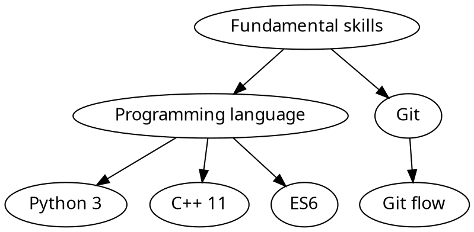
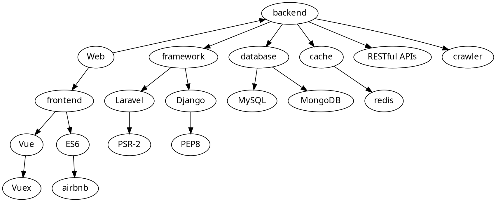
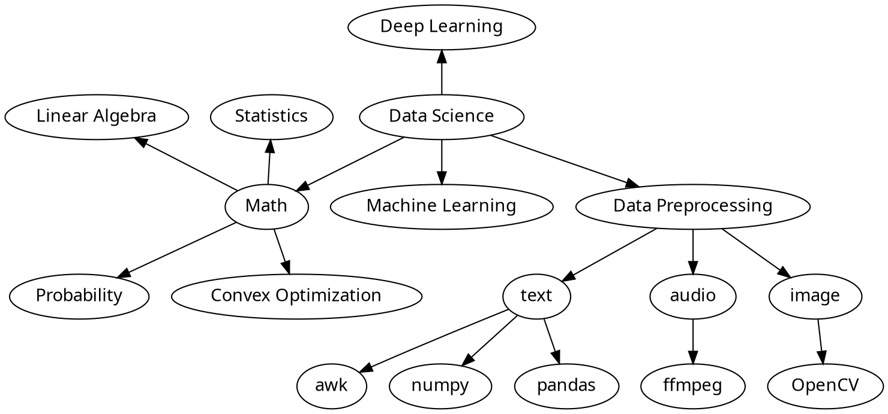

# Background

Graduate Student at National Chiao Tung University, Taiwan
Major in Data Science

# Skill tree

## Fundamental skills

## Web Development

## Data Science

## Experience

### Course

- OSDI
- Data Mining

### Project

- [Account System](https://account.cs.nctu.edu.tw/)
- Room Reservation System
- Visualization 119 in Taiwan
- Data visulization
- EZMusix