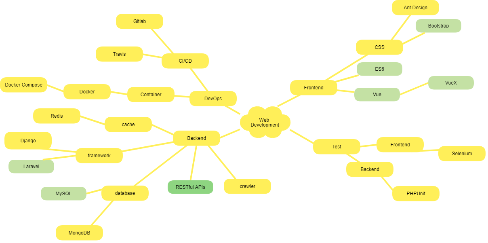
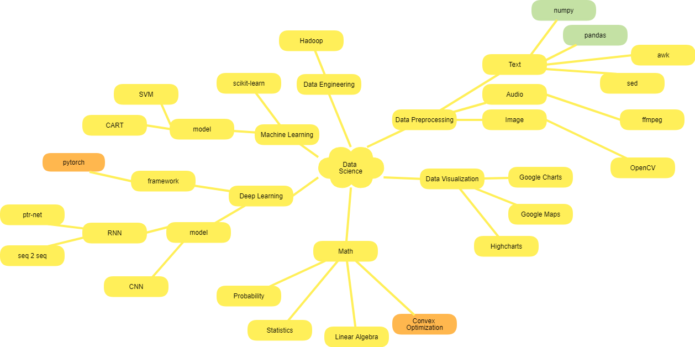

# Background

Graduate Student at National Chiao Tung University, Taiwan
Major in Data Science

# Skill tree

## Web

Greatly influenced from [developer-roadmap](https://github.com/kamranahmedse/developer-roadmap).

## Data Science

# Experience

## Course

- OSDI
- Data Mining
- Graph Theory
- Theory of Computation

## Project

- [Account System](https://account.cs.nctu.edu.tw/)
- Room Reservation System
- Visualization 119 in Taiwan
- Data visulization
- EZMusix

Last Updated: 2019/04/02