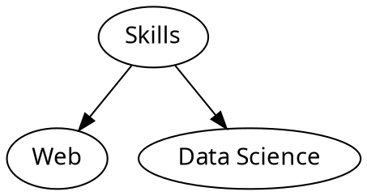
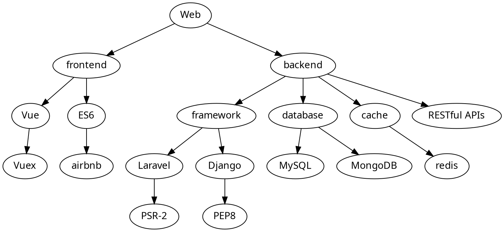
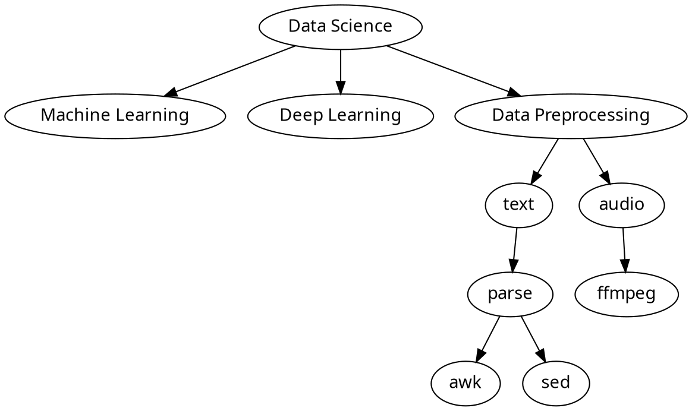

# Background

Graduate Student at National Chiao Tung University, Taiwan
Major in Data Science

# Skill tree

```graphviz
digraph hierarchy {
    node [color=Black,fontname=consolus,shape=oval] //All nodes will this shape and colour
    "Skills"->"Web"
    "Skills"->"Data Science"
}
```

```graphviz
digraph hierarchy {
    node [color=Black,fontname=consolus,shape=oval] //All nodes will this shape and colour
    subgraph Web {
        "Web"->"frontend"
        "Web"->"backend"
    }
    subgraph frontend {
        "frontend"->"Vue"
        "Vue"->"Vuex"
        
        "frontend"->"ES6"
        "ES6"->"airbnb"
   }
    subgraph backend {
        "backend"->"framework"
        "framework"->"Laravel"
        "Laravel"->"PSR-2"
        
        "framework"->"Django"
        "Django"->"PEP8"
        
        "backend"->"database"
        "database"->"MySQL"
        "database"->"MongoDB"
        
        "backend"->"cache"
        "cache"->"redis"
        
        "backend"->"RESTful APIs"
    }
}
```

```graphviz
digraph hierarchy {
    node [color=Black,fontname=consolus,shape=oval] //All nodes will this shape and colour
    subgraph data{
        "Data Science"->"Machine Learning"
        "Data Science"->"Deep Learning"
        "Data Science"->"Data Preprocessing"
    }
    subgraph preprocess{
        "Data Preprocessing"->"text"
        "Data Preprocessing"->"audio"
    }
    subgraph textPre{
        "text"->"parse"
        "parse"->"awk"
        "parse"->"sed"
    }
    subgraph audioPre{
        "audio"->"ffmpeg"
    }
}
```